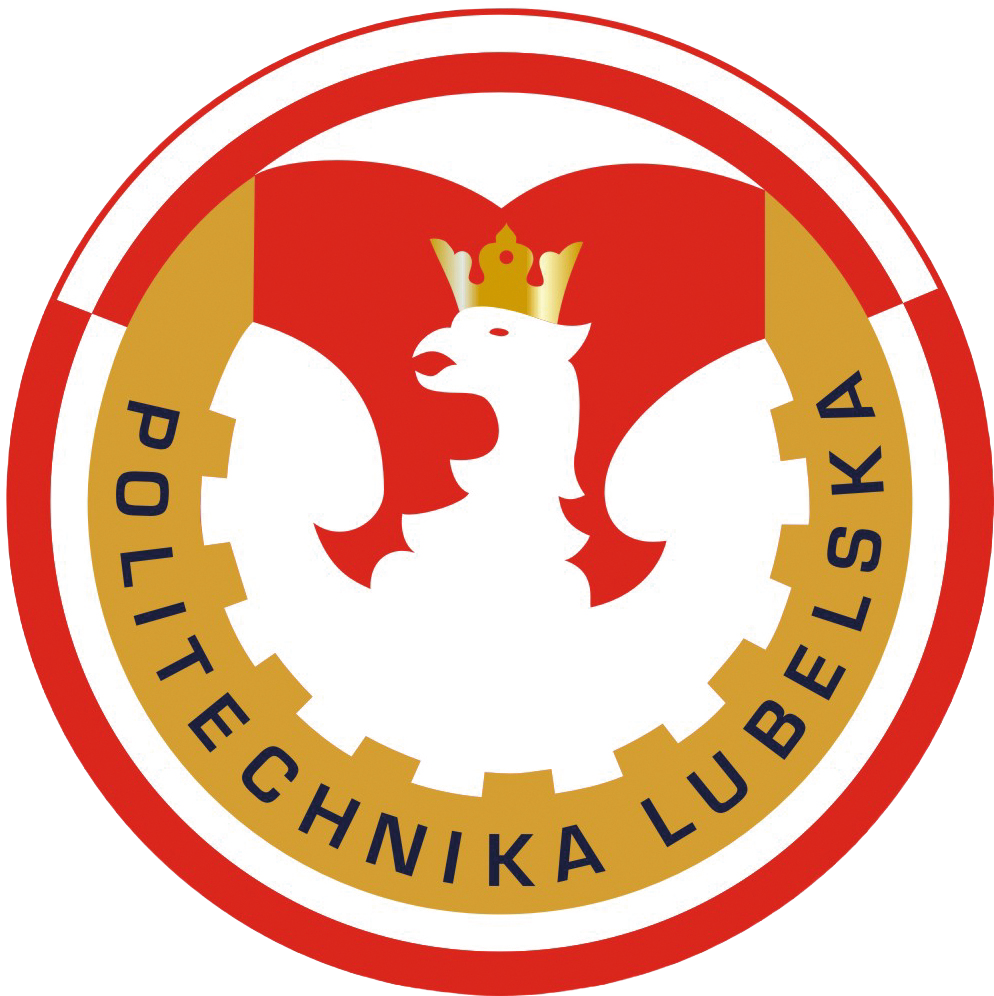

<h1>games</h1>

###

  
  
  
  
  
  
  
  
  

###

Form-based web application for displaying popular games and tv game shows on extended screen for bigger group of people or teams.

###

  

###

- Using [Next.js](https://nextjs.org/docs) framework with App Router ( /app )
- Build by [pnpm](https://pnpm.io/) package manager

###

## BEng Thesis

    
    
    

###

This is my engineering diploma project for 2025 for the Lublin University of Technology (Poland), Faculty of Electrical Engineering and Computer Science, Department of Electrical Engineering and Intelligent Technologies.

###

## Support

